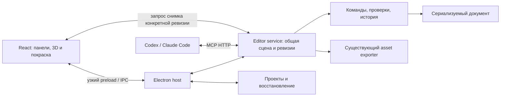

# План локальной мастерской 3D-моделей

Обновлено 4 октября 2026 года. Статус: план реализации; создан [desktop прототип](MODEL_EDITOR_FIRST_BUILD.md) с M0 и частями M1–M2; в версии 0.2 добавлен [MCP adapter общей сцены](MODEL_EDITOR_MCP.md), в 0.3 — [покраска и числовой UV editor](MODEL_EDITOR_TEXTURES.md), часть M3. В 0.4 реализованы [варианты и визуальное сравнение](MODEL_EDITOR_VARIANTS.md), в 0.5 — [тёмная тема и обзор для ИИ](MODEL_EDITOR_DARK_AND_REVIEW.md), часть M5; MCP содержит десять инструментов. Полная художественная приёмка M3, приёмка M4 обоими агентами и игровой этап не завершены. Ниже остаются критерии полного прохождения этапов.

Цель — приложение для Windows, в котором пользователь и подключённый Codex или Claude Code редактируют одну модель: меняют форму, пиксельную покраску и UV, сравнивают варианты, отменяют изменения и экспортируют результат.

План дополняет [Fabric-first MVP](FABRIC_FIRST_MVP_PLAN.md) и следует [ADR-0004](decisions/0004-fabric-1.20.1-production-baseline.md): игровой target — Fabric 1.20.1 / Java 17. Исторический [research](RESEARCH_AND_MVP_PLAN.md) используется для архитектуры и quality gates; его прежние Java/loader targets не переносятся в редактор. Рабочий цикл ассетов описан в [AI_CODE_AND_3D_WORKFLOW.md](AI_CODE_AND_3D_WORKFLOW.md).

## 1. Первый пользовательский сценарий

1. Запустить приложение и открыть меч «Северное сияние» либо создать новый предмет из кубоидов.
2. Выделить гарду в 3D или дереве частей; вручную изменить форму и цвет.
3. Закрепить рукоять от агентных изменений.
4. Подключить Codex или Claude Code к локальному MCP endpoint.
5. В привычном чате поручить агенту переделать клинок и сохранить остальные части.
6. Увидеть результат, сравнить с предыдущей версией и при необходимости отменить действие.
7. Сохранить проект, закрыть приложение и открыть его снова без потери данных.
8. Экспортировать Minecraft JSON, PNG и `.bbmodel`; отдельно проверить предмет в игре после интеграции ресурсов в мод.

Первый контрольный результат: ручная смена цвета и размера выбранной части, undo/redo и сохранение на диск. Следующий: тот же сценарий через настоящего внешнего агента.

## 2. Граница первой версии

В первую версию входят:

- кубоидные предметы и оружие в профиле Minecraft Java 1.20.1;
- создание, выделение, добавление, удаление, дублирование и изменение кубов;
- семантические части предмета, например клинок, гарда и рукоять;
- палитра, кисть, пипетка, заливка выбранной области и редактирование UV;
- один пиксельный атлас до 256×256 и палитра до 32 цветов — по текущему контракту;
- история, закрепление частей, сравнение сохранённых вариантов и восстановление проекта;
- подключение внешних агентов через MCP, чтение сцены и снимки реального результата;
- отдельный экспорт ресурсов и проверяемая последующая интеграция с Fabric compiler.

Последующие версии: носимая 3D-броня, существа, rig/анимации, произвольные mesh, сложные слои покраски и встроенный агентный чат. Для этих классов нужны свои форматы, renderer и критерии приёмки. Они не добавляются к item JSON простой сменой типа проекта.

## 3. Что можно использовать сейчас

| Компонент | Состояние и применение |
|---|---|
| `packages/assets-contracts` | Закрытые схемы геометрии и пиксельной текстуры; основа импорта и валидации |
| `packages/assets-core` | Нативный item JSON, PNG и Blockbench exporter; работает в Node и использует, в частности, `node:crypto` |
| `packages/application/item-assets.ts` | Один сервис компиляции и целостность трёх выходных файлов |
| `apps/mcp-server` | Существующий stdio-сервер с проверкой спецификаций и экспортом; его контракт сохраняется отдельно |
| `apps/model-editor/worker/mcp.ts` | Streamable HTTP adapter общей сцены, закрытые команды, revision и agent history; включается в GUI |
| `fixtures/assets/aurora-longsword-v2.item-asset.json` | Реальный исходный предмет для первого сценария и регрессий |
| `templates/item-preview.html` | Текущий просмотр для сравнения геометрии/UV; не полноценный редактор |
| `packages/compiler-fabric` и runner | Основа будущего игрового подключения; authored asset bundle пока в compiler не интегрирован |

Текущий build runner поддерживает Linux x64. Windows-редактор и его экспорт должны работать самостоятельно; реальная Gradle/GameTest/server проверка выполняется в поддерживаемой среде. Старые логи проверок являются исходной точкой, а не доказательством готовности будущего приложения.

## 4. Стек и границы процессов

| Слой | Решение |
|---|---|
| Desktop | Electron |
| Интерфейс | React, TypeScript, Vite |
| 3D | Three.js, React Three Fiber, необходимые camera/transform helpers |
| Пиксельная покраска | Canvas 2D; атлас загружается в 3D как texture |
| Состояние панелей и инструментов | Zustand |
| Документ и команды | Независимое TypeScript-ядро с Zod-схемами |
| Host / экспорт | Node-код в Electron main и отдельном utility process |
| Агентный интерфейс | Официальный MCP TypeScript SDK, Streamable HTTP на loopback |
| Файлы | Версионированный JSON-документ и PNG; Minecraft JSON / `.bbmodel` как экспорт |
| Упаковка | Electron Forge; сборка проверяется на Windows с самого первого этапа |

Точные версии и лицензии фиксируются на этапе M0. Проверка официальной документации на дату плана показывает совместимость React 19 с R3F 9; R3F 10 пока обозначен как alpha. В первую версию выбирается проверенная стабильная пара. Forge Vite plugin обозначен как experimental: если его использовать, фиксировать exact version и проверять dev/packaged запуск; запасной путь — явная сборка Vite перед Forge packaging.



Одно приложение владеет одним service и общей сценой. MCP-сессии не создают собственные копии проекта. Zustand хранит состояние интерфейса, а Three.js отображает документ; они не становятся независимыми источниками истины.

Renderer не импортирует Node-модули exporter. Main управляет окнами, файловыми диалогами и жизненным циклом worker. Service хранит активный документ и сериализует изменения. Экспорт, кодирование PNG и тяжёлые задания выполняются вне renderer. Снимки получают из настоящего 3D-рендера, с указанием ревизии; при недоступном renderer возвращается диагностическая ошибка.

## 5. Документ и изменение данных

Новый `EditorProject` описывает `schemaVersion`, `projectId`, target profile, геометрию, пиксельную текстуру, семантические части, материалы и display transforms. UI selection/camera и восстановительная история сохраняются отдельно от экспортируемых данных. Не сериализуются `THREE.Object3D`, ссылки на React и исполняемые скрипты.

Часть содержит стабильный ID и ссылки на кубы. Материал связывает поверхности с цветами для тени, основы и блика. Это позволит перекрасить выделенную гарду, сохранив рисунок и не затронув навершие того же цвета. Служебные данные частей и материалов снимаются при преобразовании в существующий asset request.

Все действия используют один набор закрытых команд: добавить/удалить кубы, изменить размеры/позицию/поворот, задать UV, нарисовать ограниченный набор пикселей, перекрасить выбранные поверхности. Ручные и агентные действия вызывают одинаковый код проверки и применения.

Порядок транзакции:

1. Прочитать текущий `projectId` и `revision`; проверить цель и закреплённые части.
2. Проверить команду и вычислить результат на рабочей копии.
3. Сформировать diff; при любой ошибке не применять ни одной команды из пакета.
4. Применить весь пакет, записать историю и увеличить ревизию.
5. Передать новую сцену renderer и запланировать восстановительное сохранение.

Каждое agent apply содержит ожидаемую ревизию и ключ идемпотентности. Повтор запроса после потери соединения не создаёт повторное действие. Устаревшая ревизия получает `REVISION_CONFLICT`; агент перечитывает проект. Undo создаёт новую ревизию, а не возвращает счётчик назад. Агент не может снять установленное пользователем закрепление или незаметно отменить чужую последнюю правку.

Перетаскивание и штрих кисти дают быстрый локальный preview, затем фиксируются как одно действие. Число записей истории ограничено. Варианты сохраняются как отдельные snapshots с происхождением, базовой ревизией и hashes; они не перезаписывают текущую модель.

Для native item profile показываются ограничения экспортёра: кубоиды, один вращаемый axis, углы 0/±22.5/±45°, координаты с `inflate` −16…32. Неподдерживаемые значения не округляются молча. Пустой новый проект можно редактировать, но он не экспортируется до появления валидной видимой геометрии.

## 6. Этапы реализации

### M0. Проверка технического основания

Сделать минимальный Electron запуск, загрузку реального меча через новый renderer, передачу типизированного сообщения в service и упаковку Windows build. Проверить bundled Node Electron: текущий репозиторий использует Node 24.11.0, но packaged app не должен зависеть от установленного у пользователя Node или выполнения исходных `.ts`.

Добавить отдельные конфигурации TypeScript для renderer `.tsx`, main, preload и worker. Сохранить строгие настройки существующих пакетов; root `build` сейчас лишь запускает typecheck и не подтверждает desktop packaging. Зафиксировать источники, версии, лицензии и integrity новых зависимостей.

**Приёмка:** упакованная тестовая сборка запускается на Windows без dev server, отображает меч с правильной текстурой и работает без внешней сети. Зафиксированы выбранные версии и способ сборки.

### M1. Документ, команды, история и сохранение

Создать схемы `EditorProject` и команд, service с ревизиями, адаптер существующих fixtures, undo/redo и сохранение JSON/PNG. Добавить резерв восстановления и проверку файлов при открытии. Запись нового snapshot выполняется до смены ссылки на текущую сохранённую версию, чтобы авария не оставляла JSON и PNG от разных ревизий.

**Приёмка:** изменить часть, отменить, повторить и открыть проект после перезапуска с теми же данными. Отрицательные тесты: stale revision, повтор команды, нарушение закрепления, повреждённый файл и ошибка сохранения. Неудачная операция сохраняет предыдущий валидный проект.

### M2. Полезный ручной 3D-редактор

Сделать дерево частей и кубов, выбор в сцене, numeric inspector, перемещение/размер/поворот, добавление, удаление и дублирование. Добавить ракурсы, ортографическую камеру, сетку, hide/lock и простой выбор цвета материала. Новые кубы получают начальные валидные UV; при нехватке места операция возвращает диагностику. Новый предмет создаётся из пустого проекта и кубоидов; редактор не ограничивается изменением готового меча.

**Приёмка:** пользователь открывает меч, выделяет гарду, меняет цвет и размер, отменяет изменения и сохраняет результат. Выбор в дереве совпадает с выбором в 3D. Проверены шесть сторон, ориентация UV и вращения; два асимметричных тестовых куба выявляют зеркальные ошибки.

### M3. Пиксельная покраска и UV

Добавить увеличенный atlas view, кисть без сглаживания, пипетку, ограниченную заливку и mask выбранной части/грани. Отображать UV и плотность пикселей; менять прямоугольники граней с проверкой границ. Обновлять texture в 3D сразу, фиксируя весь штрих одной командой.

Перекраска части не меняет глобальный цвет, используемый другими частями. Если поверхности делят UV, операция выявляет общий участок и сначала отделяет развёртку либо возвращает понятную ошибку. Добавление куба включает выделение UV; недостаток места/цветов возвращает диагностику. Перепаковка, когда требуется, переносит рисунок и UV одной транзакцией и учитывает padding; существующая покраска не сбрасывается.

**Приёмка:** вручную нарисовать руну, перекрасить только гарду, сохранить блики и рисунок, проверить соседние части и undo/redo. PNG после сохранения содержит ожидаемые RGBA. На фронте, сзади и сбоку нет случайного зеркалирования и просачивания соседних цветов.

### M4. Подключение Codex и Claude Code

Добавить отдельный editor MCP adapter, который обращается к запущенному общему service. Сохранить старые CLI/stdio tools без изменения их поведения. В настройках приложения показывать endpoint, состояние соединения и способ подключения. Авторизация выдаётся локальному клиенту; секрет не входит в проект, экспорт или логи.

Начальная поверхность инструментов:

| Предлагаемый tool | Назначение |
|---|---|
| `studio_project_create` | Новый проект с ограниченным target/brief |
| `studio_project_inspect` | Документ или выбранная часть, IDs, ревизия и diagnostics |
| `studio_selection_get` | Выделение пользователя с собственной версией |
| `studio_changes_preview` | Проверить batch, создать diff и proposal ID |
| `studio_changes_apply` | Применить proposal при совпадении ревизии и прав |
| `studio_history_undo` | Отменить допустимое последнее агентное действие |
| `studio_view_capture` | PNG выбранного ракурса для точной ревизии |
| `studio_asset_validate` | Проверка выбранного runtime profile |
| `studio_asset_export` | Экспорт данных/нового bundle в область данного проекта |

Рабочие обратимые правки выполняются в предоставленной пользователем области редактирования; отдельное принятие варианта фиксирует выбранный результат. Закрепление и границы проекта проверяются в service. Доступ к shell, generic eval, произвольным URL/путям и установке dependencies через эти tools не добавляется.

Начальные бюджеты: до 256 кубов, до 32 команд в одном batch, до 262144 байт UTF-8 запроса, атлас до 256×256, до 32 цветов. Размер snapshots, истории, PNG-ответов, время render/export и число одновременных заданий ограничиваются отдельными константами с тестами на границе. Base64-ответ имеет свой лимит с учётом расширения, а не только исходного PNG. Сначала один пишущий transaction; несколько клиентов читают одну сцену и используют проверку ревизии.

**Приёмка:** оба реальных клиента по отдельности подключаются к запущенному приложению, читают сцену, меняют выбранную часть и получают снимок результата. Эмулированный MCP client покрывает ошибки, но не заменяет эти две проверки. Устаревшая ручная/агентная правка не перезаписывается, retry не дублирует действие, переключение проекта не перенаправляет старый запрос на новый.

### M5. Цикл улучшения формы и покраски

В 0.5 добавлены тёмная тема, единый обзор четырёх ракурсов с 32/64 px и десятый MCP tool `studio_model_review`. Текущий Codex создал меч с перестроенной геометрией и пиксельным рисунком, посмотрел обзор и выполнил ещё один проход с исправлениями; исходник и промежуточный проход сохранены. [Evidence и ограничения](MODEL_EDITOR_DARK_AND_REVIEW.md). Это дальнейшая часть M5, художественная beta и самостоятельные CLI model turns ещё не приняты.

В 0.4 реализованы задание, до четырёх снимков, одинаковые фиксированные камеры, силуэт, 64 px preview и чтение вариантов через MCP: [текущий этап](MODEL_EDITOR_VARIANTS.md). Два авторских варианта меча и одна визуальная корректировка выполнены текущим Codex через реальные tools. Это ещё не приёмка самостоятельных model turns обоих CLI или художественная beta на трёх предметах.

Передавать агенту brief, palette/style constraints, структуру сцены, выделение, закрепления, diagnostics и captures. Сохранять исходную версию и 2–3 варианта; сравнивать одинаковые ракурсы и масштаб. Пример задачи: «сделай клинок выразительнее, сохрани рукоять и палитру».

Снимки создаются из настоящей геометрии и текстуры. Нейтральный свет, pixel filtering, согласованные colour space и alpha не должны скрывать швы или подменять вид декоративными эффектами. Фиксируются сторона, camera, renderer settings и ревизия. Отдельно показывается уменьшенный вид на 32/64 px; он не объявляется игровым инвентарём.

**Приёмка:** агент делает ограниченную адресную правку, смотрит новые ракурсы и исправляет конкретный дефект; закреплённые части сохраняют данные. Пользователь может выбрать вариант и вернуть предыдущий. Художественная приёмка выполняется по [rubric](quality/art-quality-rubric-v0.md) с evidence и привязкой к точному candidate hash; красота не выводится из числа кубов или отсутствия ошибок.

### M6. Экспорт и локальная beta

Добавить profile validation, управление display transforms для поддерживаемых слотов предмета, экспорт через существующий application service, hashes и provenance. Обеспечить импорт собственных editor projects и текущих asset fixtures; произвольный `.bbmodel` import не входит в первый scope. На экспорт сохраняются текущие transforms, без скрытой подмены на defaults.

Проверить packaged app: сохранение, повторное открытие, MCP, пути с пробелами/кириллицей, штатное закрытие worker/server, отказ GPU/WebGL и восстановление. Выполнить три сценария: меч, топор и жезл/посох. Снять время запуска, отзывчивость drag/paint, память и размер сборки на пользовательском Windows-хосте; пороги фиксировать по измеренному baseline, а не обещать FPS заранее.

**Приёмка beta редактора:** установка/запуск без инструментов разработчика, ручной и агентный циклы, корректное восстановление и экспорт. Blockbench импортирует экспортированный `.bbmodel`; повторный native export сохраняет геометрию, UV, texture references и transforms. Beta получает явный статус, что ресурсы экспортированы, а работа в игре ещё не доказана.

### M7. Подключение ресурсов к Fabric и проверка в игре

Создать отдельный bounded контракт интеграции asset bundle с предметом ModSpec. Он связывает item ID, target, paths, hashes и display data. Compiler проверяет namespace, references, отсутствие коллизий и воспроизводимость; authored ресурсы становятся явными входами BuildPlan. Compatibility pack не изменяется скрытой подменой. Если pack revision потребуется, она проходит собственные checksums и regression gates.

Собрать проверяемый fixture на поддерживаемом Linux x64 runner / CI. Проверить состав remapped JAR и реальную загрузку ресурсов. Запустить clean build, относящиеся к регистрации/ссылкам GameTests, dedicated server и клиентские проверки: инвентарь, первая/третья персона, обе руки, ground/fixed, свет и mipmaps. Server проверяет отсутствие client-only загрузки; visual proof получают из клиента.

**Приёмка игрового результата:** точная Fabric 1.20.1 / Java 17 матрица, полный evidence bundle и human approval конкретного candidate. До этого приложение не показывает «проверено в игре». Packaging мода отделён от публикации.

## 7. Предлагаемая структура изменений

```text
apps/model-editor/
  main/                  окна, preload bridge, файлы и запуск service
  preload/               закрытый API renderer → host
  worker/                service, MCP HTTP adapter и export jobs
  renderer/              React, Three.js, панели и покраска
  tsconfig.*.json         отдельная проверка renderer/host
packages/editor-core/
  contracts.ts           EditorProject, части, команды и diagnostics
  commands.ts            атомарное применение и инварианты
  history.ts             undo/redo, revisions и snapshots
  assets-adapter.ts      перевод editor document ↔ существующий asset request
fixtures/editor/
  projects/              асимметричная геометрия и сценарии редактирования
  scenarios/             ручные и агентные acceptance cases
```

Сначала добавляются новые небольшие модули. Старые compiler, packs и MCP server не реорганизуются ради приложения. При необходимости общей схемы она выносится отдельным небольшим изменением с regression tests. Node-зависимые операции экспорта остаются за границей renderer. SQLite и отдельный remote backend для первого editor project не требуются; библиотека проектов может получить свой индекс позднее.

## 8. Проверки и критерии завершения

Проверки добавляются к соответствующему этапу:

- core: инварианты команд, atomic rollback, ревизии, идемпотентность, закрепления и undo;
- painting: decoded PNG pixels, masks, shared UV, обратимые переносы островов и лимиты палитры;
- сохранение: interruption/corruption/recovery и недопустимые пути/версии;
- UI/Electron: реальный selection, drag, paint, save/reopen, worker restart и packaged запуск;
- MCP: схемы, размер UTF-8, неверные/неавторизованные запросы, Origin, конфликт ревизий и настоящие клиентские вызовы;
- export: детерминированный bundle, resource paths, native/Blockbench соответствие и transforms;
- игровой этап: clean build, JAR integrity, GameTests, dedicated server и клиентские screenshots.

Использовать существующий Node/assert подход для core и Playwright Electron E2E для desktop поведения. Новую test dependency проверять и фиксировать на M0/M2. `lint` и typecheck должны включать `.tsx` и все desktop entrypoints; зелёный прежний root typecheck их автоматически не покрывает. Ошибки существующей Windows build-среды указываются отдельно и не маскируются успешной desktop упаковкой.

MVP мастерской завершается на M6: один установленный редактор, ручные изменения, оба агентных клиента, восстановление, варианты и корректный экспорт. M7 завершает следующий результат — подтверждённый игровой предмет. Общий Minecraft Mod Studio MVP из Fabric-first plan остаётся отдельной более широкой задачей.

## 9. Порядок поставки и точки пересмотра

Порядок: `M0 → M1 → M2 → M3 → M4 → M5 → M6 → M7`. Каждый этап разбивается на небольшие проверяемые изменения с работающим результатом. Упаковка и export regression проверяются по ходу, а не впервые в конце.

- После M0 уточняются exact dependencies, bundled Node совместимость и стоимость packaging.
- После M2 пользователь проверяет удобство выбора, пропорций и простой перекраски.
- После M3 проверяются качество покраски, UV и сохранение художественной работы.
- После M4 отдельно подтверждаются реальное подключение обоих агентов и отсутствие конфликтов ручных правок.
- После M5 оценивается визуальная польза агентных итераций на трёх предметах. При слабом результате улучшаются brief, инструменты, покраска и feedback, а не увеличивается количество кубов ради отчёта.
- После M6 возможна локальная beta. После M7 возможно утверждение проверенного игрового candidate.

Календарные сроки уточняются после M0 и M2: объём полноценного UV/paint editor, упаковка и доступная игровая test-среда ещё не измерены. Первая задача реализации — M0 и минимальный проход через реальный меч; затем документ/команды и ручное редактирование M1–M2.

## 10. Проверенные источники

Документация сверена 3 октября 2026 года; Context7 использован для Electron process/IPC/utility-process границ. Ниже ссылки на первичные источники, а не гарантия совместимости будущего dependency набора:

- [Electron process model](https://www.electronjs.org/docs/latest/tutorial/process-model): main/renderer/utility process и bridge.
- [Electron security, официальный исходник](https://github.com/electron/electron/blob/main/docs/tutorial/security.md): context isolation, sandbox, узкие IPC, sender validation и ограничение navigation. Для release загружать локальные ресурсы через контролируемый app protocol; `nodeIntegration: false`, `contextIsolation: true`, `sandbox: true`.
- [React Three Fiber introduction](https://r3f.docs.pmnd.rs/getting-started/introduction): renderer поверх Three.js и совместимость major versions.
- [Electron Forge Vite plugin](https://www.electronforge.io/config/plugins/vite): experimental статус и отдельная сборка main/preload/renderer.
- [MCP Streamable HTTP](https://modelcontextprotocol.io/specification/2025-11-25/basic/transports): независимый service, sessions и loopback/Origin/auth требования. Endpoint привязывается к `127.0.0.1`; проверяются Host и присутствующий Origin, используется токен соединения; CORS не заменяет авторизацию.
- [MCP tools](https://modelcontextprotocol.io/specification/2025-11-25/server/tools): закрытые input/output contracts, diagnostics и image content для настоящих снимков.
- [Blockbench Java codec](https://github.com/JannisX11/blockbench/blob/v5.0.0/js/io/formats/java_block.js) и [bbmodel codec](https://github.com/JannisX11/blockbench/blob/v5.0.0/js/io/formats/bbmodel.js): существующий export profile; последующие версии проверяются отдельно.

Способ подключения Codex и Claude Code сверялся в предыдущем обсуждении по [документации Codex MCP](https://learn.chatgpt.com/docs/extend/mcp?surface=cli) и [Claude Code MCP](https://code.claude.com/docs/en/mcp). Реализация M4 повторно проверяет актуальные клиентские версии и подтверждает их настоящими вызовами.
